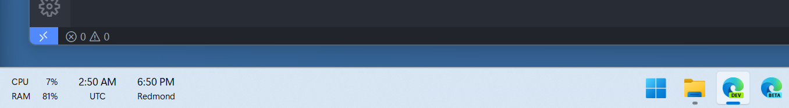

# TimeToolbar
A simple Windows system tray application and taskbar overlay to show times from multiple time zones.

# License
This application is available under the MIT License.

# Icon
Icon file: https://icon-icons.com/icon/clock/48329, from Cheat Sheet icons https://icon-icons.com/pack/Cheat-Sheet-icons/494
Free version of https://linearicons.com/
Created by https://perxis.com/
Licensed under CC BY-SA 4.0 (Creative Commons Attribution-ShareAlike 4.0 International)
https://creativecommons.org/licenses/by-sa/4.0/
